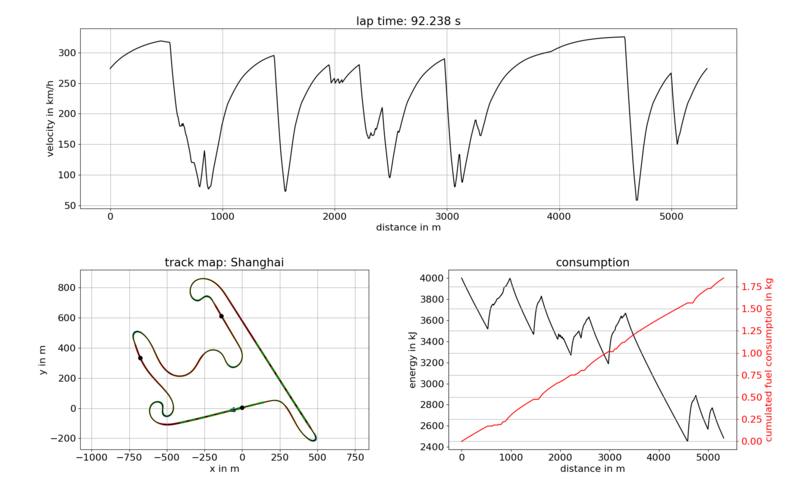

# LaptimeSim + E-lemons

## Introduction

This repository contains a quasi-steady-state lap time simulation implemented in Python. It can be used to evaluate the
effect of various vehicle parameters on lap time and energy consumption. To generate a proper raceline for a given race
track, it furthermore contains our minimum curvature optimization.
We at the Heidebrecht E-lemons team have hijacked this repository and taken it for our own purposes!

Contact person: [Alexander Heilmeier](mailto:alexander.heilmeier@tum.de).
E-lemons contact persion: [Matt Heidebrecht](mailto:heidebrecht.matt@gmail.com).

## E-lemons brief

Steps to make the simulation go:

1. Set arguments in `sim_config.toml`
   1. Pay attention to the track selected `track_opts_.trackname`
      1. If you want to use elevation then:
         1. Set `track_opts_.use_elevation` to `true`
         2. Make sure the track file has z points in the 3rd column for every x, y
   2. If you're feeling sassy set some `driver_opts_`.
   3. Set the race weekend schedule: `race_characteristics_.gwc_times` -> this will eventually be associated with each track in the series.
   4. Leave `sa_opts_.use_sa`
   5. Play with the `debug_opts_` if you feel like it, don't worry about it though
2. Set car parameters in your desired car (`.toml`) file under `/laptimesim/inputs/vehicle`
   1. The `car_properties_` section is what the elemons people have added, these entries can be one value or a list of 3 values to indicate `[min_value, max_value, num_steps]` for that variable. See the notes in the vehicle `.toml` for more information
   2. `veh_pars_` are what came with the original simulation. Set these to the actual car parameters, though do note that some of them will get overwritten with different values to run the different simulation configurations.
      1. Vars to not worry about in this section (`main_laptimesim.py: 205-ish`):
         1. Rolling Resistance `f_roll`
         2. Car mass `m`
         3. Drag coefficient `c_w_a`
         4. Maximum motor torque `torque_e_motor_max`
         5. Maximum motor power `pow_e_motor_max`
      2. Read up on the other car variables, over time elemons people will insert ourselves more and more into this section.
3. Run `main_laptimesim.toml` this will output the data into a csv, no graphing will happen
   1. If you're not using the car `FE_Berlin.toml` pass it in as an argument
   2. If you're not using the sim config `sim_config.toml` pass it in as an argument
   3. TODO: If you're not using the track config `track_config.toml` pass it in as an argument
4. Graph the results using `plot_results.py`
   1. You must pass the results you want in as an argument.
5. Happy simulating!

## List of components

* `laptimesim`: This python module is used to simulate the lap time of a specified race car on a given race track as
accurate as possible. It can furthermore be used to evaluate the effects of parameter changes, e.g. the lap time
sensitivity against mass. The `input` folder contains the racelines and track parameters as well as the vehicle
parameters. Please see the paper linked below for further information.
* `opt_raceline`: This python module is used to determine a proper raceline for a given race track. The used approach is
based on a minimization of the summed curvature. It is extracted from our main repository.
[global_racetrajectory_optimization](https://github.com/TUMFTM/global_racetrajectory_optimization). Please see the paper linked below for further information.

## Dependencies

Use the provided `requirements.txt` in the root directory of this repo, in order to install all required modules.\
`pip3 install -r /path/to/requirements.txt`

The code is tested with Python 3.8.3 on Windows 10 and 3.6.8 on Ubuntu 18.04.

### Solutions for possible installation problems (Windows)

`cvxpy`, `cython` or any other package requires a `Visual C++ compiler` -> Download the build tools for Visual Studio
2019 ([visual studio](https://visualstudio.microsoft.com/de/downloads/) -> tools for Visual Studio 2019 -> build tools), install them and
chose the `C++ build tools` option to install the required C++ compiler and its dependencies

### Solutions for possible installation problems (Ubuntu)

1. `matplotlib` requires `tkinter` -> can be solved by `sudo apt install python3-tk`
2. `Python.h` required `quadprog` -> can be solved by `sudo apt install python3-dev`

## Intended workflow

The intended workflow is as follows:

* `opt_raceline`: Calculate a proper raceline for the race track.
* `laptimesim`: Use the determined raceline in the lap time simulation to calculate the velocity profile, lap time,
energy consumption and so on. Sensitivity analysis can be performed to determine further parameters, e.g. the lap time
mass sensitivity.

## Running the raceline optimization

If the requirements are installed on the system, follow these steps:

* `Step 1`: (optional) The race track can be supplied in two formats: `.csv` and `.geojson`. The former includes not
only the centerline but also the track widths `[x, y, w_tr_right, w_tr_left]`. The latter contains only the centerline.
Add your own files to the according folder, either `/opt_raceline/input/centerlines/geojson` or
`/opt_raceline/input/tracks/csv`. A `.geojson` file can be extracted from map services such as OpenStreetMap, for
example (see separate instructions below). Additionally to this step, a track map should be copied to
`/opt_raceline/input/maps` to be able to check the track data during the import. Such a track map can be obtained from the
FIA, e.g. on [FIA Event Timing](https://www.fia.com/events/fia-formula-one-world-championship/season-2017/eventtiming-information)
* `Step 2`: Check the user input section in the upper part of `main_opt_raceline.py`. It might be necessary to test a
little bit to find a working parameter set for the individual race track.
* `Step 3`: Execute `main_opt_raceline.py` to start the raceline optimization process. During the import of the track data
file you will see a plot of the track on its corresponding track map (if it was provided in the first step). In case of
a GeoJSON file you must select which of the sections should be used. By clicking on the legend entries you can activate
or deactivate the corresponding lines in the plot to obtain a closed but unique
centerline. Additionally, you can enter the ID of the section containing the start finish line into the text field. As
soon as you close the plot the final status will be used for the further processing steps. If there is only one line for
the whole race track, this step seems unncessary (e.g. Budapest). However, many exported GeoJSON data files will contain
a lot of different lines (e.g. Shanghai).
* `Step 4`: If the optimization was finished successfully, you will see a plot of the optimized raceline as well as
its curvature profile (if using the standard plotting options). For a later usage in the lap time simulation it is
of great importance that this curvature profile is smooth because this heavily influences simulation result. Enter the
presented length of the raceline into the `track_pars.ini` file within the `laptimesim` folder and copy
the exported raceline from the output folder to the according input folder of the lap time simulation. Furthermore, the
smoothed centerline was saved in the output folder and can be used if required, e.g. for plotting purposes.

### Detailed description of the curvature minimization used during the raceline optimization

Please refer to our paper for further information:\
Heilmeier, Wischnewski, Hermansdorfer, Betz, Lienkamp, Lohmann\
Minimum Curvature Trajectory Planning and Control for an Autonomous Racecar\
DOI: 10.1080/00423114.2019.1631455

### Extracting the centerline of a race track from OpenStreetMap

* `Step 1`: Open [Overpass Turbo](https://overpass-turbo.eu/) This is a tool to extract map informations from OpenStreetMap.
* `Step 2`: Navigate to the desired race track, e.g. the Red Bull Ring in Austria.
* `Step 3`: Paste the following search into the text field and execute the search to highlight everything which is tagged
as a raceway.
<!-- language: lang-none -->
    [out:json][timeout:25];
    (
      node["highway"="raceway"]({{bbox}});
      way["highway"="raceway"]({{bbox}});
      relation["highway"="raceway"]({{bbox}});
    );
    out body;
    >;
    out skel qt;
* `Step 4`: Click "export" and save it as a GeoJSON. Be aware that the export might include a lot of unnecessary points
which must be excluded either in a separate step or during the import. 
* `Step 5`: Note: (RMH) Before running main_opt_raceline.py , the exported geojson file should be put in the project directory: laptime-simulation/opt_raceline/input/centerlines

* `Step 6`:  Edit/add a "track_pars" structure for the track of interest structure 
* `Step 7`:  Run "python3 main_opt_raceline.py"

Note: (RMH) Per the above warning, I got errors when running main_opt_raceline.py 
	the first time with a raw geojson file exported from OpenStreets like:
		Traceback (most recent call last):
		  File "main_opt_raceline.py", line 478, in <module>
		    main(track_pars=track_pars_,
		  File "main_opt_raceline.py", line 111, in main
		    refline_imp = opt_raceline.src.import_geojson_gps_centerline.\
		  File "/home/rick/eLemons/old-rdriven-laptime_simulation/laptime-simulation/opt_raceline/src/import_geojson_gps_centerline.py", line 54, in import_geojson_gps_centerline
		    tmp_xy[i] = utm.from_latlon(tmp_gps[i][1], tmp_gps[i][0])[:2]
		  File "/home/rick/.local/lib/python3.8/site-packages/utm/conversion.py", line 190, in from_latlon
		    raise OutOfRangeError('latitude out of range (must be between 80 deg S and 84 deg N)')
		utm.error.OutOfRangeError: latitude out of range (must be between 80 deg S and 84 deg N)

	To eliminate the errors you can hand edit the geojson file to remove the track 
	description Feature and possibly a couple "non track" sections also included in it. 
	For instance in Gingerman.geojson the track description 

Note:  Insert the actual track length and width (and put in the main_opt_raceline data structure) 
	for that track, by visiting the desired track's website and look it up, figure it out, etc. 
	Or look at the length of past races from our eLemons_vehicle_and_track_data Gdrive sheet. 
	You'll have to be clever because each track & race chooses some sections of track which 
	changes the length. 

Note: When executing main_opt_raceline for a track .geojson file that includes pit lanes and additional
	track sections not associated with the track of interest, as one of the first steps the 
	program lets you deselect unwanted sections of the roadways by clicking their colored lines 
	in the legend.  
	** You'll need to delselect extra sections of track**, or else the curve algorithm
	will try to fit a curve to the all the sections- yikes! 

Note: If you have to deselect sections, make sure you set the # in Start ID control in the text box in 
	upper right corner of the GUI to a reasonable (existing) track section number. The best choice 
	is section with the (straight) start/finish line. If you pick a curved section the 
	optimizer has a problem with starting velocity, it seems, and the code will bomb.

Note: Sometimes the Section 0 starts in a corner which makes the main_laptimesim have heartburn 
	and throw errors when you start it. You'll need to shuffle the .geojson coordinates before 
	running the main_opt_raceline step so that the start of the simulation is more or less on 
	a straightaway.

Note: Once pared down, retire the image by clicking X in the right hand corner
	and to allow main_opt_raceline to continue its calculations.
	
Note: The output of this step is a centerlines\"trackname".csv file
	Copy this file to /laptimesim/input/tracks/racelines
	e.g. cp opt_raceline/output/racelines/Gingerman.csv laptimesim/input/tracks/racelines/.

## Running the lap time simulation

If the requirements are installed on the system, follow these steps:

* `Step 1`: (optional) Adjust a given or create a new vehicle parameter file (.toml) for the simulation. The files are
located in `/laptimesim/input/vehicles`.
* (optional) Set the iteration parameters in the vehicle parameter file.
* `Step 2`: (optional) Adjust a given or create a new track. Every track consists of some parameters (e.g. length)
  as well as a raceline. Therefore, you have to make sure the parameters are given in
  `/laptimesim/input/tracks/track_pars.ini` and the raceline is available in `/laptimesim/input/tracks/racelines`.
  Additionally, you can place a .png track map in `/laptimesim/input/tracks/maps`.

* `Step 4`: Run `main_laptimesim.py`.

### Detailed description of the lap time simulation

Please refer to our paper for further information:

<!-- language: lang-none -->
    @inproceedings{Heilmeier2019,
    doi = {10.1109/ever.2019.8813646},
    url = {https://doi.org/10.1109/ever.2019.8813646},
    year = {2019},
    month = may,
    publisher = {{IEEE}},
    author = {Alexander Heilmeier and Maximilian Geisslinger and Johannes Betz},
    title = {A Quasi-Steady-State Lap Time Simulation for Electrified Race Cars},
    booktitle = {2019 Fourteenth International Conference on Ecological Vehicles and Renewable Energies ({EVER})}}

## Related open-source repositories

* Race simulation: [race simulation](https://github.com/TUMFTM/race-simulation)
* Race track database: [racetrack database](https://github.com/TUMFTM/racetrack-database)
* Formula 1 timing database: [f1 timing database](https://github.com/TUMFTM/f1-timing-database)
